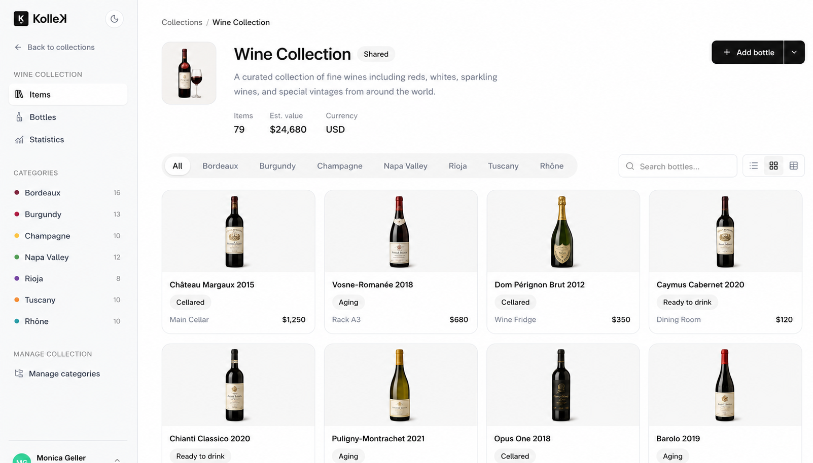

<div align="center">

# KolleK

**The open source home for everything you collect.**

<p align="center">
 <picture>
  <source media="(prefers-color-scheme: dark)" srcset="docs/github/app_dark_mode.png">
  
</picture>
</p>

KolleK is a self hostable web application for cataloguing collections of any kind, from comics and vinyl records to coins, watches, and wine. Organize your items, track every physical copy you own, record what you paid and what it is worth, and keep the whole history in one private, encrypted place.

[](https://github.com/djaiss/beaver/actions/workflows/tests.yml)
[](https://github.com/djaiss/beaver/actions/workflows/static.yml)
[](LICENSE)
[](https://www.php.net)
[](https://laravel.com)
[](#contributing)

[Features](#features) · [Quick start](#quick-start-with-docker) · [Development](#local-development) · [API](#api) · [Contributing](#contributing)

</div>

---

## Table of contents

- [Overview](#overview)
- [Features](#features)
- [Tech stack](#tech-stack)
- [Quick start with Docker](#quick-start-with-docker)
- [Local development](#local-development)
- [Configuration](#configuration)
- [Core concepts](#core-concepts)
- [API](#api)
- [Internationalization](#internationalization)
- [Testing](#testing)
- [Roadmap](#roadmap)
- [Contributing](#contributing)
- [Security](#security)
- [License](#license)
- [Acknowledgements](#acknowledgements)

## Overview

Most collectors end up juggling spreadsheets, notes apps, and their own memory. KolleK replaces all of that with one focused tool.

Every account is a private, multi user workspace. You create collections, describe the kinds of things they hold with your own custom fields, and add items with photos, tags, and physical copies. KolleK tracks the condition, storage location, and value of each copy, keeps a full audit trail of who changed what, and exposes everything through a documented JSON API. Sensitive data is encrypted at rest.

It is built to be run by anyone: a single collector on a small server, or a group sharing a catalogue with fine grained roles.

## Features

### Cataloguing

- **Collections.** Group your items into named collections, each with its own emoji, description, currency, and visibility (private, shared, or public).
- **Types and custom fields.** Describe what a collection holds with your own field definitions (text, number, date, boolean, or select). Ships with a dozen ready made types such as Comics, Vinyl Records, Coins, Stamps, Books, Video Games, Watches, and Wine.
- **Field groups.** Organize a type's custom fields into labelled sections so long forms stay readable.
- **Categories.** Nest items inside a collection, for example Marvel within a comics collection.
- **Items and photos.** Add catalogue entries with a description, multiple photos (one main visual, reorderable), and tags.
- **Copies.** Track each physical instance you own, with its own condition, storage location, acquisition date, price paid, and estimated value.
- **Sets.** Group items collected as a series and track completion.

### Organization

- **Locations.** Record where items are physically stored, nested as deeply as you like (a shelf inside a box inside a room).
- **Conditions.** Grade items from New to Damaged, with per account defaults you can rename or extend.
- **Tags.** Reusable free form labels that work across every collection in your account.
- **Valuation.** Roll up what a collection cost and what it is worth, in your account currency.

### Collaboration and safety

- **Teams and roles.** Invite people into your account as owners, editors, or viewers, with permissions enforced on every write.
- **Audit trail.** Every action is logged and surfaced as an activity feed on the dashboard.
- **Encryption at rest.** Sensitive values are encrypted in the database using Laravel's built in encryption.
- **Two factor authentication** and passwordless **magic link** sign in.

### Platform

- **JSON API.** A token authenticated REST API covers the whole catalogue, with a reference that is generated from the code and served at `/docs`.
- **Webhooks.** Send events to your own endpoints.
- **Self hosting.** A production Docker image and Compose stack, with data safe upgrades. See [Quick start with Docker](#quick-start-with-docker).
- **Localized.** Available in seven languages out of the box.

## Tech stack

| Layer      | Technology                                             |
| ---------- | ------------------------------------------------------ |
| Backend    | PHP 8.4, Laravel 13                                    |
| Frontend   | Blade, Tailwind CSS 4, Alpine.js, Alpine Ajax, Vite    |
| Database   | MySQL 8 (SQLite supported for local development)       |
| Auth       | Laravel Sanctum, Google Authenticator, magic links     |
| Queue      | Database driven jobs (Redis optional)                  |
| Testing    | Pest, PHPStan, Laravel Pint                            |
| Deployment | Docker (nginx, PHP-FPM, supervisor)                    |

## Quick start with Docker

The fastest way to run your own instance. You need Docker Engine 24 or newer with the Compose plugin.

```bash
git clone https://github.com/djaiss/beaver.git kollek
cd kollek

cp .env.docker.example .env

# Generate a unique application key and paste it into .env as APP_KEY.
docker compose run --rm app php artisan key:generate --show

# Review the passwords and APP_URL in .env, then start everything.
docker compose up -d --build
```

Open the URL you set in `APP_URL` (http://localhost:8000 by default) and create your account.

The stack runs the web server, a queue worker, a scheduler, and MySQL. Your database and uploaded files live in named volumes that are independent of the image, so pulling a newer version only ever applies new migrations and never resets your data. The full guide, including upgrades and backups, is in [docker/README.md](docker/README.md).

## Local development

For working on KolleK itself.

**Requirements**

- PHP 8.4 with the `gd`, `exif`, `bcmath`, `pcntl`, and `intl` extensions
- Composer 2
- Node 20 or newer, or Bun (the `composer setup` script uses Bun)
- A database (SQLite works with no setup; MySQL 8 is recommended for parity with production)

**Setup**

```bash
git clone https://github.com/djaiss/beaver.git kollek
cd kollek

composer setup
```

The `composer setup` script installs dependencies, creates your `.env`, generates an application key, runs the migrations, and builds the front end assets.

**Run the app**

```bash
composer dev
```

This starts the web server, the queue listener, the log viewer, and the Vite dev server together. KolleK is then available at http://localhost:8000.

## Configuration

All configuration lives in the `.env` file. The values you are most likely to change:

| Variable                | Purpose                                                        |
| ----------------------- | -------------------------------------------------------------- |
| `APP_NAME`              | The name shown across the interface.                           |
| `APP_URL`               | The public URL of your instance.                               |
| `APP_KEY`               | Encryption key. Unique per instance, never change it in place. |
| `DB_*`                  | Database connection settings.                                  |
| `MAIL_*`                | Outgoing email (SMTP or Resend). Defaults to the log.          |
| `APP_LOCALE`            | Default interface language.                                    |
| `FILESYSTEM_DISK`       | Where uploaded item photos are stored.                         |

For a self hosted deployment, `.env.docker.example` documents the recommended production values.

## Core concepts

A quick mental model of how KolleK is organized:

- An **account** is the workspace and the unit of tenancy. Everything below belongs to exactly one account.
- **Users** belong to an account and hold a role: owner, editor, or viewer.
- A **collection** holds **items**. Each item can carry a **type** (which decides its custom fields), sit in a **category**, and belong to a **set**.
- An item has one or more **copies**, the physical things you actually own. A copy has a **condition**, a **location**, and acquisition details.
- **Tags**, **locations**, and **conditions** are shared across the whole account and reused everywhere.

## API

KolleK ships a token authenticated JSON API that mirrors the web application. Authenticate with a personal access token (Laravel Sanctum) and send it as a bearer token:

```bash
curl https://your-instance.example/api/collections \
  -H "Authorization: Bearer YOUR_TOKEN" \
  -H "Accept: application/json"
```

The complete reference, with request and response examples for every endpoint, is generated from the codebase and served at `/docs` on your instance.

## Internationalization

The interface is translated into English, French, Spanish, German, Portuguese (Brazil), Chinese (Simplified), and Japanese. Each user picks their own language, and visitors can switch language right from the sign in page. Translations live as one file per locale under `lang/`.

## Testing

The test suite runs on [Pest](https://pestphp.com).

```bash
# Run the full test suite.
composer test

# Format the code (Prettier, Laravel Pint, and Rector).
composer lint
```

Code style is handled by Laravel Pint and Prettier, refactoring by Rector, and static analysis by PHPStan. All of them are enforced in continuous integration alongside the tests.

## Roadmap

KolleK is under active development. Planned and in progress work includes provenance history for copies, richer valuation reporting, import and export tools, and public collection sharing. Follow the [issues](https://github.com/djaiss/beaver/issues) to see what is coming and to weigh in.

## Contributing

Contributions are welcome and appreciated. Whether it is a bug report, a feature idea, a translation, or a pull request, thank you for helping.

1. Fork the repository and create a branch for your change.
2. Follow the existing code style (Laravel Pint) and add tests for new behavior.
3. Make sure `composer test` and `composer lint` pass.
4. Open a pull request with a clear description of what changed and why.

New to the project? Issues labelled `good first issue` are a friendly place to start.

## Security

If you discover a security vulnerability, please do not open a public issue. Instead, email the maintainer privately so it can be addressed before disclosure. Every report will be reviewed promptly.

## License

KolleK is open source software licensed under the [MIT license](LICENSE).

## Acknowledgements

Built with [Laravel](https://laravel.com), [Tailwind CSS](https://tailwindcss.com), [Alpine.js](https://alpinejs.dev), and [Pest](https://pestphp.com), and inspired by every collector who has ever outgrown a spreadsheet.

<div align="center">

If KolleK is useful to you, consider giving it a star to help others find it.

</div>
